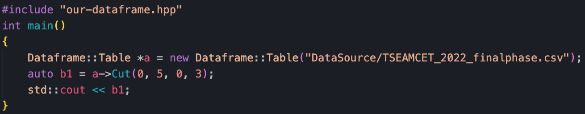
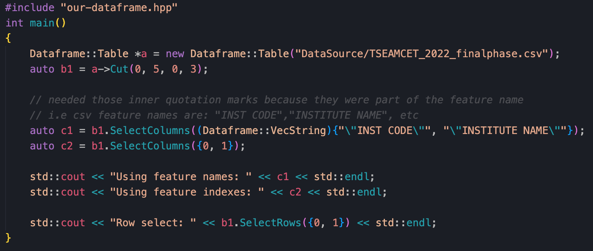

# OurDataframe
A dataframe library written entirely in C++, inspired by Python's pandas library. 
This project is built to support the MLA library enabling users to carry out: 
- Data cleaning and preparation
- Data tranformation(cutting either by rows or columns or both, removing and adding values)
- Reading and writing data from csv files
- Exploratory analysis(collecting info on nulls/non-nulls in dataset, summary statistics, etc)
- Arithmetic operations with data(Int or Float)

Functions are self-explanatory by their names. Check the our-dataframe.hpp file for functions available

## Examples:
### Reading and Cutting data

#### Result:

### Select data by columns/rows
You can select columns via their column names or column index:

#### Result:

