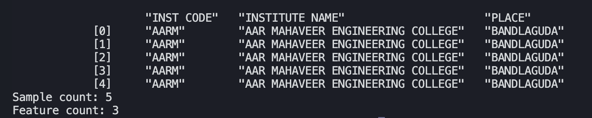
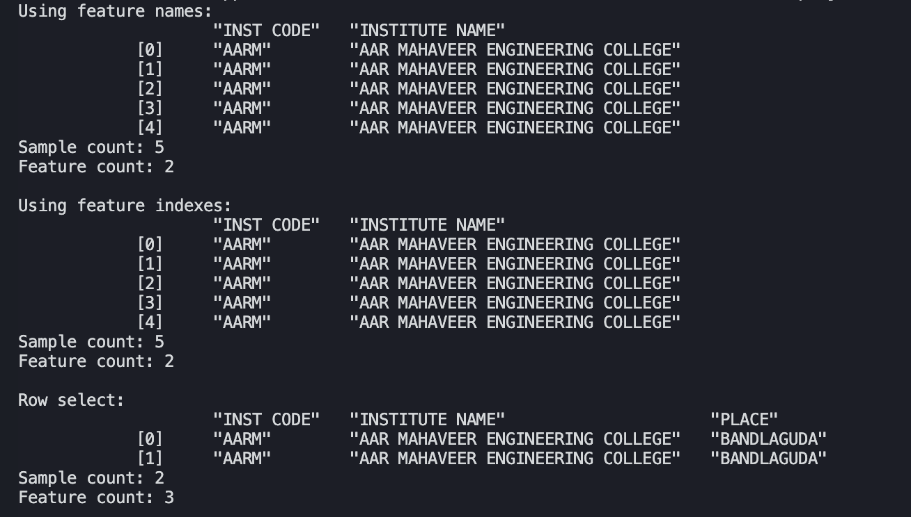

# ODf - OurDataframe
A dataframe library written entirely in C++, inspired by Python's pandas library. 
This project was built to support the MLA library enabling users to carry out: 
- Data cleaning and preparation
- Data tranformation(cutting either by rows or columns or both, removing and adding values)
- Reading and writing data from csv files
- Exploratory analysis(collecting info on nulls/non-nulls in dataset, summary statistics, etc)
- Arithmetic operations with data(Int or Float)
- Converting dataframes to raw formats

Functions are self-explanatory by their names. Check the our-dataframe.hpp file for functions available

## Examples
<strong>Note the name of header file has been updated from "our-dataframe.hpp" to "ODf.hpp". <strong>
  
### Reading and Cutting data
    #include "ODf"
    int main()
    {
        Dataframe::Table *a = new Dataframe::Table ("DataSource/TSEAMCET_2022_finalphase.csv");
        auto b1 = a->Cut (0, 5, 0, 3);
        std::cout << b1;
    }

#### Result:

### Select data by columns/rows
You can select columns via their column names or column index:

    #include "ODf.hpp" 
    int main(){
        ODf::Table *a = new ODf::Table("DataSource/TSEAMCET_2022_finalphase.csv");
        auto b1 = a->Cut(0, 5, 0, 3);

        // needed those inner quotation marks because they were part of the feature name
        // i.e csv feature names are: "INST CODE","INSTITUTE NAME", etc

        auto c1 = b1.SelectColumns((ODf::VecString){"\"INST CODE\"", "\"INSTITUTE NAME\""});
        auto c2 = b1.SelectColumns({0, 1});

        std::cout << "Using feature names: " << c1 << std::endl;
        std::cout << "Using feature indexes: " << c2 << std: :endl;
        std::cout << "Row select: " << b1.SelectRows({0, 1}) << std::endl;
    }

#### Result:

